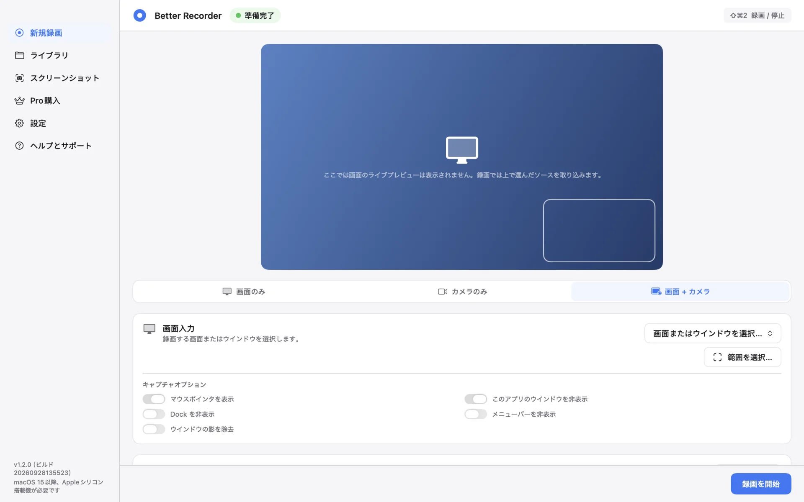
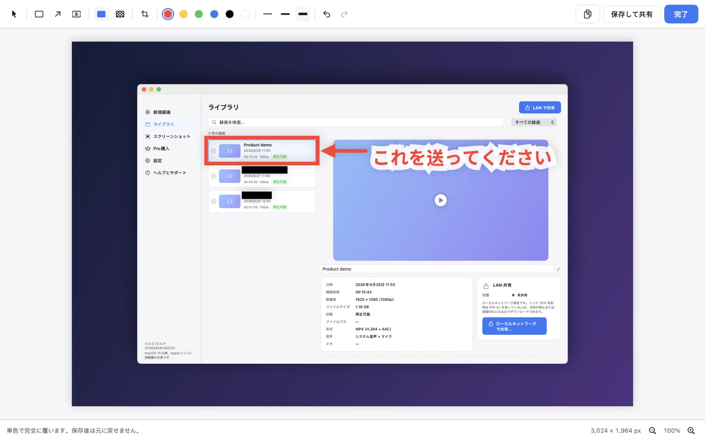
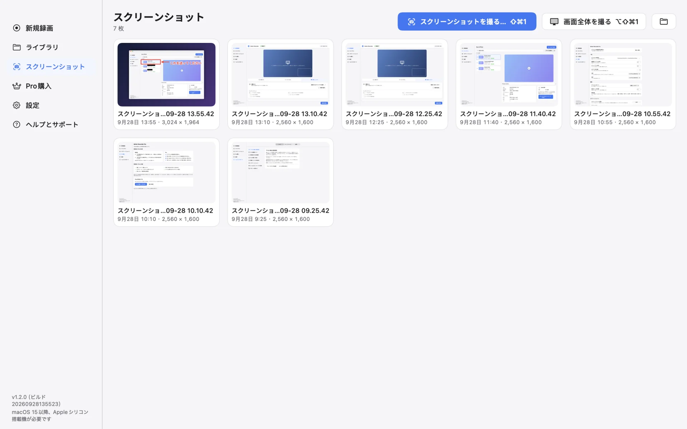
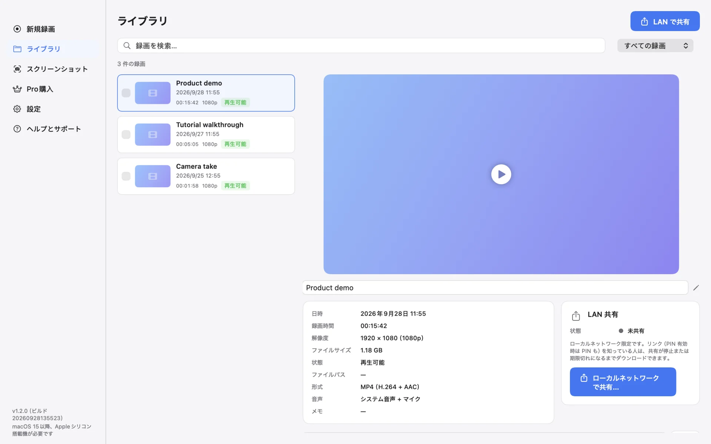
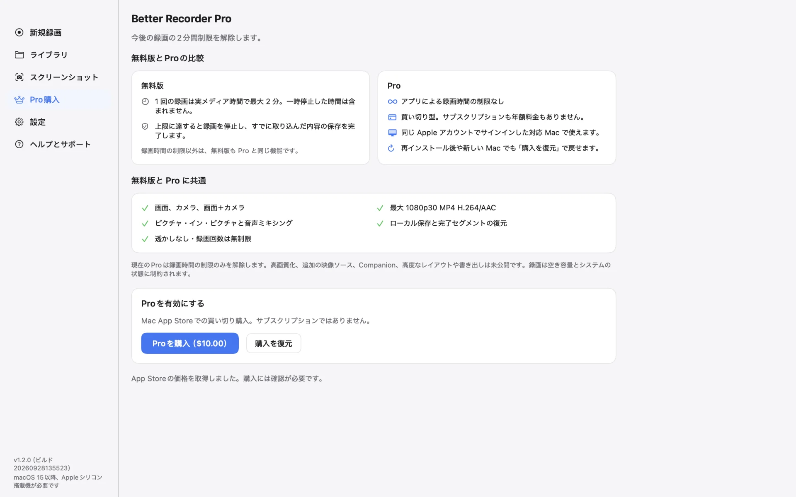
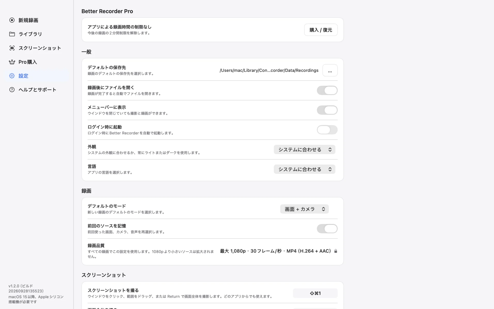

# Better Recorder Pro

[English](README.md) · [简体中文](README.zh-CN.md) · 日本語 · [한국어](README.ko.md)

画面やカメラ、またはその両方を録画し、スクリーンショットに注釈や塗りつぶしを加えられるネイティブ macOS アプリです。

Better Recorder Pro は、デモやチュートリアル、プレゼンテーションの録画に向いています。録画ファイルとスクリーンショットは Mac に保存され、アプリがアップロードすることはありません。

## ダウンロード

<table>
  <tr>
    <td align="center" width="220">
       
      読み取って App Store で開く
    </td>
    <td>
      
      
<b>無料でダウンロード</b> · Pro は任意の買い切り · サブスクなし · アカウント不要

      
macOS 15 以降 · Apple シリコン

      
<a href="https://github.com/mas-cli/mas">mas</a> をお使いなら：<code>mas get 6809041086</code>

    </td>
  </tr>
</table>

## 主な機能

- **3つの録画モード** — 画面のみ、カメラのみ、画面 + カメラのピクチャ・イン・ピクチャ。画面またはウインドウ、カメラ、マイクを選択でき、画面を含むモードでは利用可能な場合にシステム音声も録音できます。
- **範囲の録画** — 画面の一部だけを録画。マウスポインタの表示、Dock・メニューバー・このアプリのウインドウの非表示、ウインドウの影の除去を選べます。
- **スクリーンショット** — ⇧⌘1 を押してウインドウをクリック、範囲をドラッグ、または Return で画面全体を撮影。⌥⇧⌘1 なら、ポインタのあるディスプレイをすぐに撮影できます。PNG で保存され、クリップボードにもコピーされます。
- **スクリーンショットエディタ** — 塗りつぶし、モザイク、切り取り、四角形、矢印、テキスト。塗りつぶしは単色で覆い、保存すると元のピクセルは残りません。モザイクは見た目をぼかすだけです。
- **ライブラリと LAN 共有** — 録画の検索、名前の変更、確認ができます。選んだ録画やスクリーンショットを、有効期限と任意の PIN 付きの一時的な LAN 共有で共有でき、同じネットワーク上のブラウザからダウンロードできます。
- **ファイルはローカルに保存** — 1080p30 プリセットで、H.264 映像と AAC 音声の MP4 ファイルとして保存します。実際の出力は選択したソースとデバイスによって異なります。
- **ネイティブな macOS 体験** — グローバルショートカット、メニューバーアイコン、ライト／ダーク外観、英語・簡体字中国語・日本語・韓国語の4言語に対応したインターフェイス。

## スクリーンショット

**スクリーンショットエディタ** — 6つのツールで注釈を加え、共有する前に見せたくない部分を塗りつぶせます

| | |
|---|---|
|  |  |
| **スクリーンショット** — すべての撮影をひとつの場所に。範囲選択や画面全体の撮影もすぐに | **ライブラリ** — 長さ、解像度、形式、音声を一覧でき、そのままローカルネットワークで共有 |
|  |  |
| **無料版と Pro** — 機能は同じで、Pro は録画時間の制限を解除 | **設定** — 保存場所、メニューバー、外観、言語、デフォルトのモード、ショートカット |

スクリーンショットはサンプルデータを使ってアプリから生成しています。録画名は架空のものです。

## 無料版と Pro

- 無料版では3つの録画モード、スクリーンショット、エディタを利用でき、1回につき実際の録画内容を120秒まで保存できます。一時停止中の時間は含まれません。
- 上限に達すると、録画を停止してそれまでの内容を保存した後に、アップグレードをご案内します。
- Pro は任意の買い切り（非消耗型）App 内課金で、1回の録画時間制限を解除します。サブスクリプションではありません。再インストール後や、同じ Apple アカウントでサインインした別の Mac では「購入を復元」を使ってください。
- 現在、Pro で解除されるのは録画時間の制限のみです。

## プライバシーと既知の制限

- 録画ファイルとスクリーンショットは Mac に保存され、アプリがアップロードすることはありません。
- LAN 共有はご自身で開始した場合にのみ動作します。ローカルネットワーク上で HTTP を使い、何もアップロードせず、クラウドストレージも使いません。停止、有効期限切れ、ネットワークの変更、アプリの終了で無効になります。同じネットワーク上でリンク（有効にしている場合は PIN も）を知っている人は共有項目をダウンロードできるため、PIN を有効にしてください。
- 録画には対応する macOS の権限（画面収録、カメラ、マイク）と、録画対象となる方の同意が必要です。
- 録画が中断した場合、完了済みのセグメントの復元を試みます。復元は可能な範囲で行われ、未完了のセグメントや末尾部分が失われることがあります。
- Mac の内蔵カメラや対応する USB カメラを使用できます。Apple が定めるデバイス、アカウント、接続の条件を満たす場合、対応する iPhone を連係カメラとして使用できます。iPhone のカメラ映像を使う機能で、iPhone の画面は録画しません。

## サポート

- [Mac App Store](https://apps.apple.com/app/id6809041086)
- [製品ページ](https://bettermac.net/en/products/better-recorder/)
- [不具合を報告](https://github.com/BetterMacNet/better-recorder/issues/new?template=bug_report.md)
- [機能をリクエスト](https://github.com/BetterMacNet/better-recorder/issues/new?template=feature_request.md)
- [セキュリティの報告](SECURITY.md)
- [サポートセンター](https://bettermac.net/en/support/?product=better-recorder)
- [お問い合わせ](https://bettermac.net/en/contact/?product=better-recorder)
- [ウェブサイト](https://bettermac.net/)
- [プライバシーポリシー](https://bettermac.net/en/privacy/)
- [利用規約](https://bettermac.net/en/terms/)

## 動作環境

- macOS 15.0（Sequoia）以降
- Apple シリコン搭載の Mac

## ライセンス

Better Recorder Pro および本リポジトリのオリジナル資料はプロプライエタリであり、オープンソースではありません。All rights reserved. BetterMacNet の事前の書面による許可なく、これらを複製、改変、配布、使用するライセンスは付与されません。
