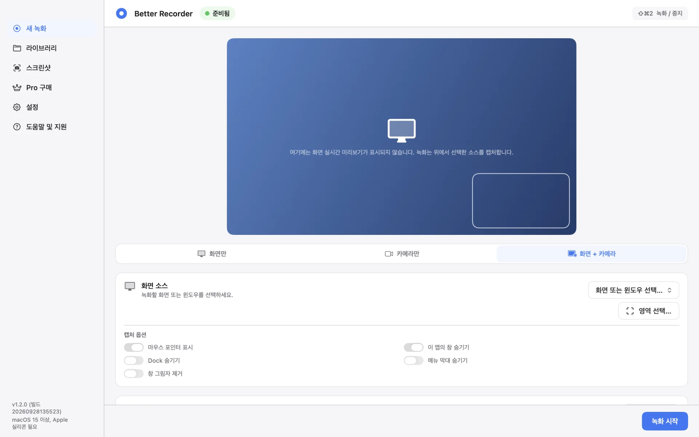
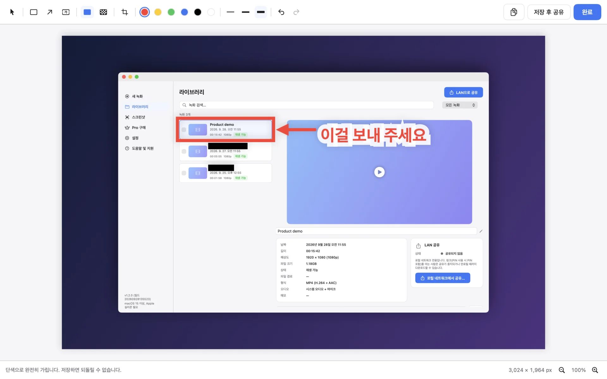
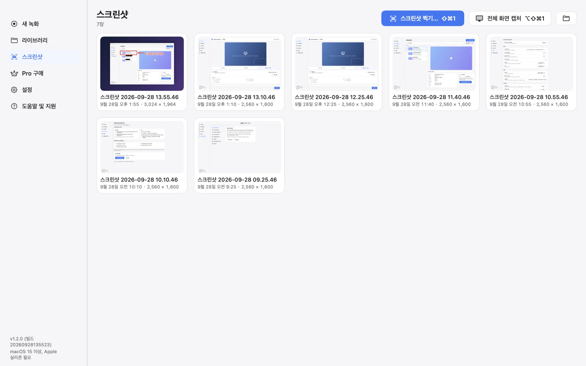
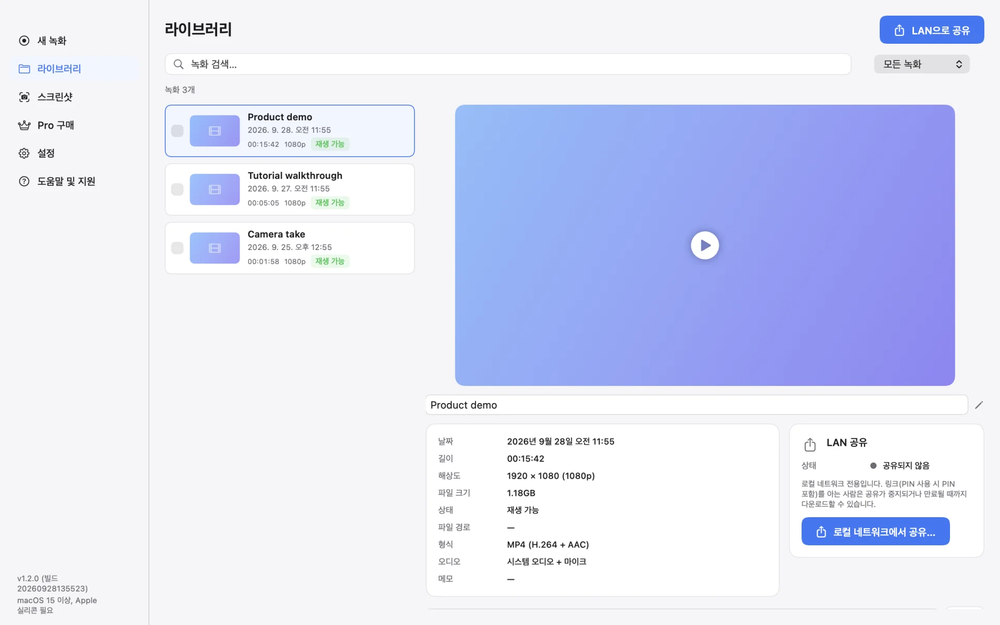
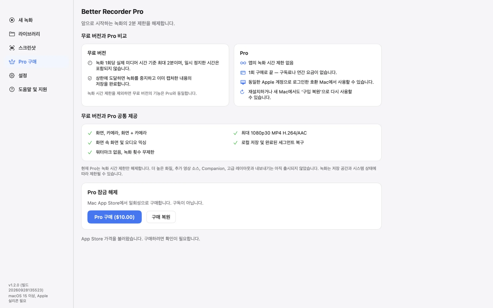
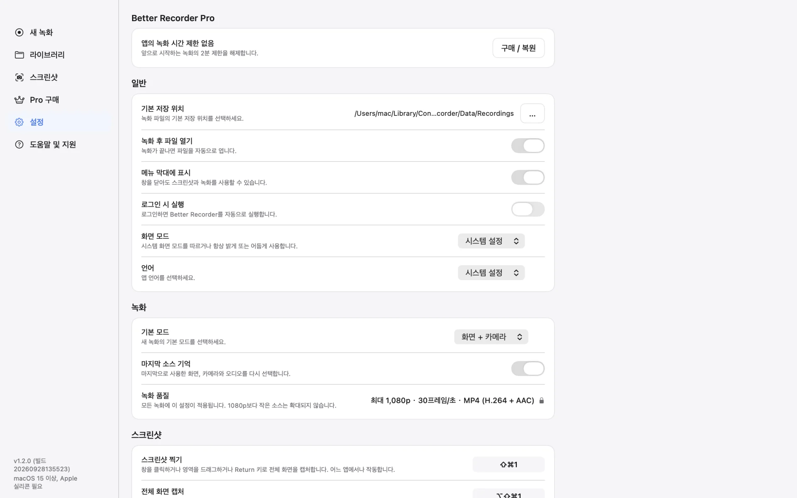

# Better Recorder Pro

[English](README.md) · [简体中文](README.zh-CN.md) · [日本語](README.ja.md) · 한국어

화면, 카메라 또는 둘 다 녹화하고, 스크린샷에 주석과 가리기를 더할 수 있는 네이티브 macOS 앱입니다.

Better Recorder Pro는 데모, 튜토리얼, 프레젠테이션 녹화에 적합합니다. 녹화 파일과 스크린샷은 Mac에 저장되며, 앱은 이를 업로드하지 않습니다.

## 다운로드

<table>
  <tr>
    <td align="center" width="220">
       
      스캔하여 App Store에서 열기
    </td>
    <td>
      
      
<b>무료 다운로드</b> · 선택 사항인 Pro 일회성 구매 · 구독 없음 · 계정 불필요

      
macOS 15 이상 · Apple 실리콘

      
<a href="https://github.com/mas-cli/mas">mas</a>를 사용한다면: <code>mas get 6809041086</code>

    </td>
  </tr>
</table>

## 주요 기능

- **세 가지 녹화 모드** — 화면만, 카메라만 또는 화면 + 카메라의 화면 속 화면. 화면이나 창, 카메라와 마이크를 선택하고, 화면이 포함된 모드에서는 사용 가능한 경우 시스템 오디오도 녹음할 수 있습니다.
- **영역 녹화** — 화면의 일부만 녹화합니다. 마우스 포인터 표시, Dock·메뉴 막대·이 앱의 창 숨기기, 창 그림자 제거를 선택할 수 있습니다.
- **스크린샷** — ⇧⌘1을 누른 뒤 창을 클릭하거나 영역을 드래그하거나 Return 키로 전체 화면을 캡처하세요. ⌥⇧⌘1을 누르면 포인터가 있는 디스플레이를 바로 캡처합니다. PNG로 저장되고 클립보드에도 복사됩니다.
- **스크린샷 편집기** — 가리기, 모자이크, 자르기, 사각형, 화살표, 텍스트. 가리기는 단색으로 덮으며 저장하면 원래 픽셀은 남지 않고, 모자이크는 시각적으로만 흐리게 합니다.
- **라이브러리와 LAN 공유** — 녹화를 검색하고, 이름을 바꾸고, 확인할 수 있습니다. 선택한 녹화나 스크린샷을 만료 시점과 선택 사항인 PIN을 갖춘 임시 LAN 공유로 공유하면, 같은 네트워크의 브라우저에서 다운로드할 수 있습니다.
- **파일은 로컬에 저장** — 1080p30 프리셋으로 H.264 비디오와 AAC 오디오를 MP4 파일에 저장합니다. 실제 출력은 선택한 소스와 기기에 따라 달라집니다.
- **네이티브 macOS 경험** — 전역 단축키, 메뉴 막대 아이콘, 라이트/다크 모드, 영어·중국어 간체·일본어·한국어 네 가지 인터페이스 언어.

## 스크린샷

**스크린샷 편집기** — 여섯 가지 도구로 주석을 달고, 공유하기 전에 보이면 안 되는 부분을 가리세요

| | |
|---|---|
|  |  |
| **스크린샷** — 모든 캡처를 한곳에서, 영역 선택이나 전체 화면 캡처도 바로 | **라이브러리** — 길이, 해상도, 형식, 오디오를 한눈에 보고 로컬 네트워크로 바로 공유 |
|  |  |
| **무료 버전과 Pro** — 기능은 같고, Pro는 녹화 시간 제한을 해제 | **설정** — 저장 위치, 메뉴 막대, 모양, 언어, 기본 모드, 단축키 |

스크린샷은 샘플 데이터로 앱에서 렌더링한 것이며, 녹화 이름은 가상입니다.

## 무료 버전과 Pro

- 무료 버전에서는 세 가지 녹화 모드, 스크린샷, 편집기를 사용할 수 있으며, 회당 실제 녹화 내용은 최대 120초입니다. 일시 정지한 시간은 포함되지 않습니다.
- 제한에 도달하면 먼저 녹화를 중지하고 이미 녹화된 내용을 저장한 뒤 업그레이드를 안내합니다.
- Pro는 선택 사항인 일회성 비소모성 앱 내 구입으로, 회당 녹화 시간 제한을 해제합니다. 구독이 아닙니다. 다시 설치한 뒤나 같은 Apple 계정으로 로그인한 다른 Mac에서는 「구매 복원」을 사용하세요.
- 현재 Pro는 녹화 시간 제한만 해제합니다.

## 개인정보 보호와 알려진 제한

- 녹화 파일과 스크린샷은 Mac에 저장되며, 앱은 이를 업로드하지 않습니다.
- LAN 공유는 사용자가 직접 시작할 때만 작동합니다. 로컬 네트워크에서 HTTP를 사용하며, 아무것도 업로드하지 않고 클라우드 저장소도 사용하지 않습니다. 중지, 만료, 네트워크 변경 또는 앱 종료 시 링크가 더 이상 작동하지 않습니다. 같은 네트워크에서 링크(활성화한 경우 PIN 포함)를 아는 사람은 공유 항목을 다운로드할 수 있으므로 PIN을 켜 두세요.
- 녹화하려면 관련 macOS 권한(화면 기록, 카메라, 마이크)과 녹화 대상자의 동의가 필요합니다.
- 녹화가 중단되면 완료된 세그먼트의 복구를 시도합니다. 복구는 가능한 범위에서 수행되며, 미완료 세그먼트나 마지막 부분이 손실될 수 있습니다.
- Mac 내장 카메라나 호환되는 USB 카메라를 사용할 수 있습니다. Apple의 기기, 계정 및 연결 요구 사항을 충족하면 호환되는 iPhone을 연속성 카메라로 사용할 수 있습니다. iPhone의 카메라 영상을 사용하는 기능이며, iPhone 화면은 녹화하지 않습니다.

## 지원

- [Mac App Store](https://apps.apple.com/app/id6809041086)
- [제품 페이지](https://bettermac.net/en/products/better-recorder/)
- [버그 신고](https://github.com/BetterMacNet/better-recorder/issues/new?template=bug_report.md)
- [기능 요청](https://github.com/BetterMacNet/better-recorder/issues/new?template=feature_request.md)
- [보안 문제 신고](SECURITY.md)
- [지원 센터](https://bettermac.net/en/support/?product=better-recorder)
- [문의하기](https://bettermac.net/en/contact/?product=better-recorder)
- [웹사이트](https://bettermac.net/)
- [개인정보 처리방침](https://bettermac.net/en/privacy/)
- [이용 약관](https://bettermac.net/en/terms/)

## 시스템 요구 사항

- macOS 15.0(Sequoia) 이상
- Apple 실리콘 탑재 Mac

## 라이선스

Better Recorder Pro와 이 저장소의 원본 자료는 독점 소프트웨어이며 오픈 소스가 아닙니다. All rights reserved. BetterMacNet의 사전 서면 허가 없이 이를 복사, 수정, 배포 또는 사용할 수 있는 라이선스는 부여되지 않습니다.
