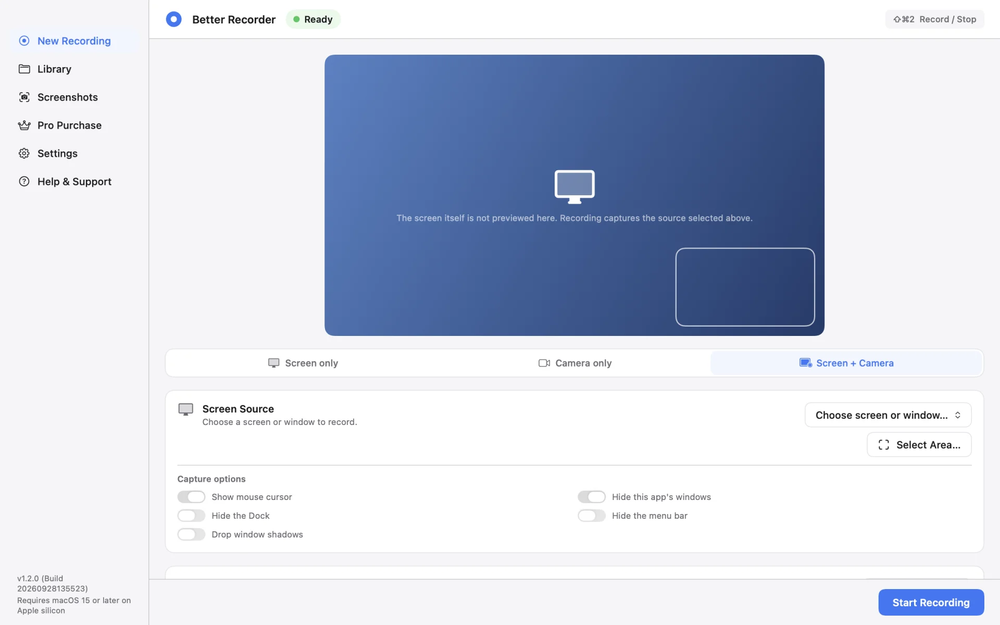
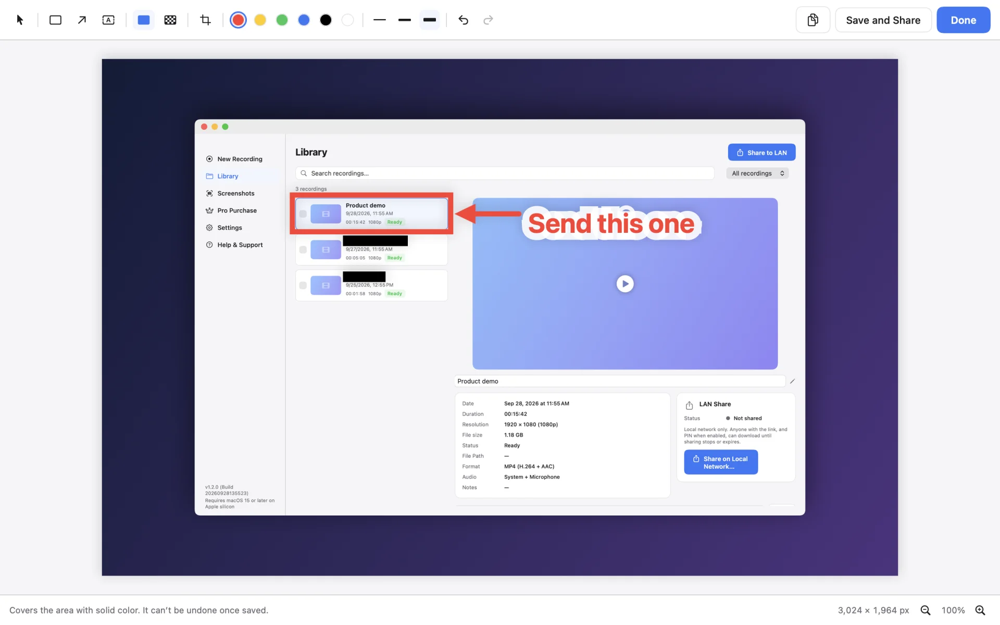
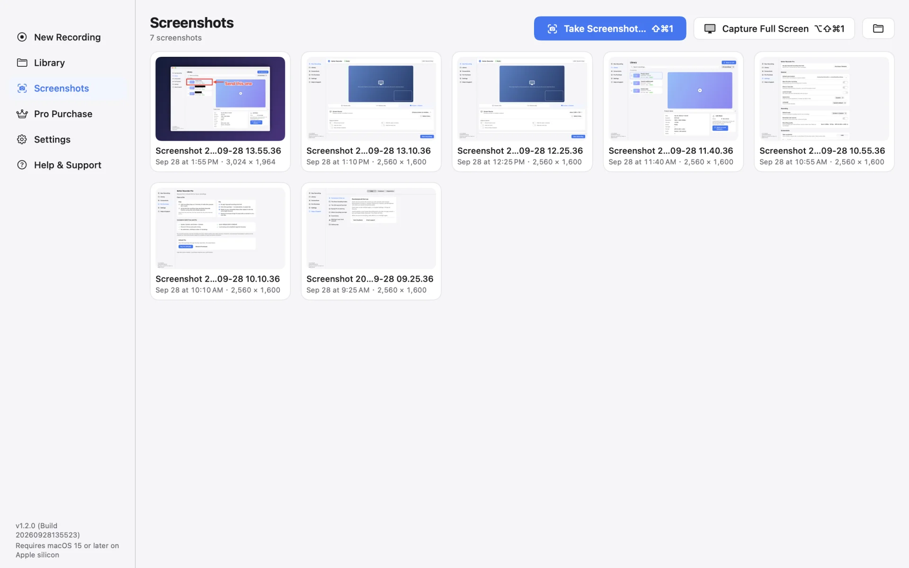
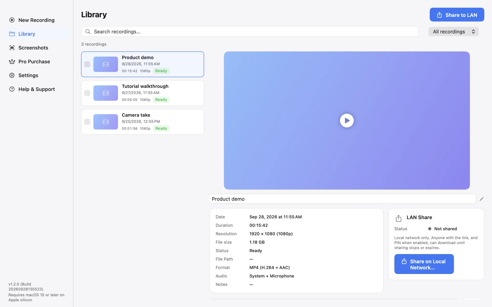
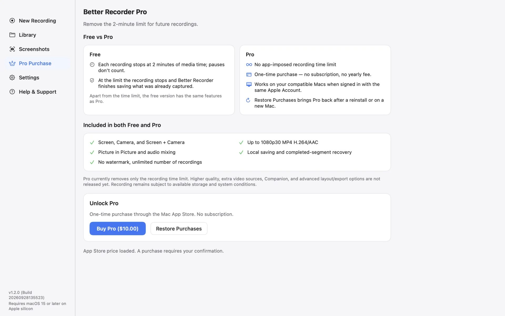
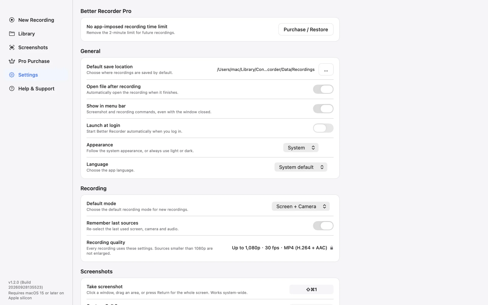

# Better Recorder Pro

English · [简体中文](README.zh-CN.md) · [日本語](README.ja.md) · [한국어](README.ko.md)

A native macOS app for recording your screen, your camera, or both, and for taking screenshots you can mark up and redact.

Better Recorder Pro is made for demos, tutorials, and presentations. Recordings and screenshots are saved on your Mac; the app does not upload them.

## Download

<table>
  <tr>
    <td align="center" width="220">
       
      Scan to open in the App Store
    </td>
    <td>
      
      
<b>Free to download</b> · optional one-time Pro · no subscription · no account

      
macOS 15 or later · Apple silicon

      
Using <a href="https://github.com/mas-cli/mas">mas</a>? <code>mas get 6809041086</code>

    </td>
  </tr>
</table>

## Highlights

- **Three recording modes** — Screen only, Camera only, or Screen + Camera with a picture-in-picture camera view. Pick a screen or window, a camera, and a microphone, and include system audio in screen modes when available.
- **Area recording** — Record just part of a screen, with options to show the mouse cursor, hide the Dock, the menu bar, or this app's windows, and drop window shadows.
- **Screenshots** — Press ⇧⌘1, then click a window, drag an area, or press Return for the whole screen; ⌥⇧⌘1 captures the display under the pointer straight away. Screenshots are saved as PNG and copied to the clipboard.
- **Screenshot editor** — Redact, Pixelate, Crop, Rectangle, Arrow, and Text. Redact covers an area with solid color, and the original pixels are gone once you save; Pixelate is visual blurring only.
- **Library and LAN Share** — Find, rename, and review your recordings. Start a temporary LAN Share for the recordings or screenshots you select, with an expiry and an optional PIN; a browser on the same network can download them.
- **Local files** — MP4 with H.264 video and AAC audio using the 1080p30 preset. Actual output depends on the selected source and device.
- **Native macOS experience** — Global shortcuts, a menu bar icon, light and dark appearance, and four interface languages: English, Simplified Chinese, Japanese, and Korean.

## Screenshots

**Screenshot editor** — mark up with six tools, and redact what should not be seen before you share

| | |
|---|---|
|  |  |
| **Screenshots** — every capture in one place, with shortcuts for a selection or the full screen | **Library** — recordings with duration, resolution, format, and audio, ready to share on your local network |
|  |  |
| **Free and Pro** — the same features, and Pro removes the recording time limit | **Settings** — save location, menu bar, appearance, language, default mode, and shortcuts |

Screenshots are rendered from the app with sample data; recording names are fictional.

## Free and Pro

- Free includes all three recording modes, screenshots, and the editor, with up to 120 seconds of recorded media per recording. Paused time does not count.
- At the limit, the app stops and saves what was already captured before offering an upgrade.
- Pro is an optional one-time, non-consumable in-app purchase. It removes the per-recording time limit and is not a subscription. Use **Restore Purchases** after a reinstall or on another Mac signed in with the same Apple Account.
- Pro currently removes only the recording time limit.

## Privacy and known limits

- Recordings and screenshots stay on your Mac. The app does not upload them.
- LAN Share is started only by you. It uses HTTP on your local network, uploads nothing, does not use cloud storage, and stops on Stop, expiry, network change, or app quit. Anyone on the network with the link, and the PIN when enabled, can download the shared items, so turn on the PIN.
- Recording needs the relevant macOS permissions (Screen Recording, Camera, Microphone) and consent from anyone you record.
- If a recording is interrupted, the app tries to recover the completed segments. Recovery is best effort; unfinished segments or the last part may be lost.
- You can use the built-in camera, a compatible USB camera, or a compatible iPhone as Continuity Camera when Apple's device, account, and connection requirements are met. This uses the iPhone camera; it does not record the iPhone screen.

## Support

- [Mac App Store](https://apps.apple.com/app/id6809041086)
- [Product page](https://bettermac.net/en/products/better-recorder/)
- [Report a bug](https://github.com/BetterMacNet/better-recorder/issues/new?template=bug_report.md)
- [Request a feature](https://github.com/BetterMacNet/better-recorder/issues/new?template=feature_request.md)
- [Security reporting](SECURITY.md)
- [Support center](https://bettermac.net/en/support/?product=better-recorder)
- [Contact us](https://bettermac.net/en/contact/?product=better-recorder)
- [Website](https://bettermac.net/)
- [Privacy Policy](https://bettermac.net/en/privacy/)
- [Terms of Use](https://bettermac.net/en/terms/)

## Requirements

- macOS 15.0 (Sequoia) or later
- A Mac with Apple silicon

## License

Better Recorder Pro and the original materials in this repository are proprietary and not open source. All rights reserved. No license is granted to copy, modify, distribute, or use them without prior written permission from BetterMacNet.
