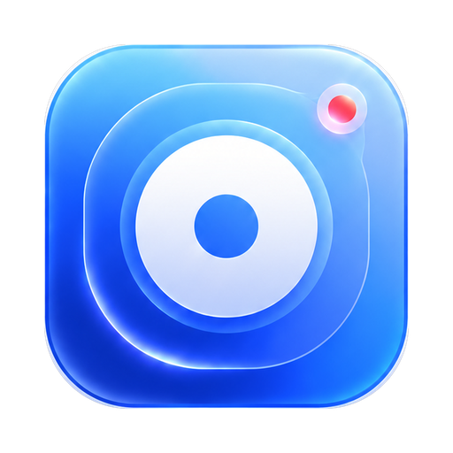
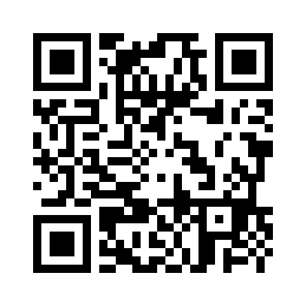
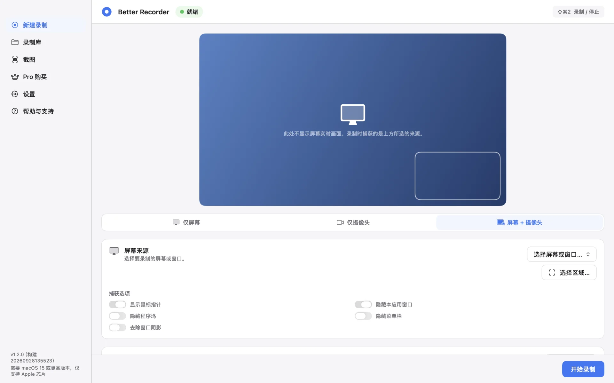
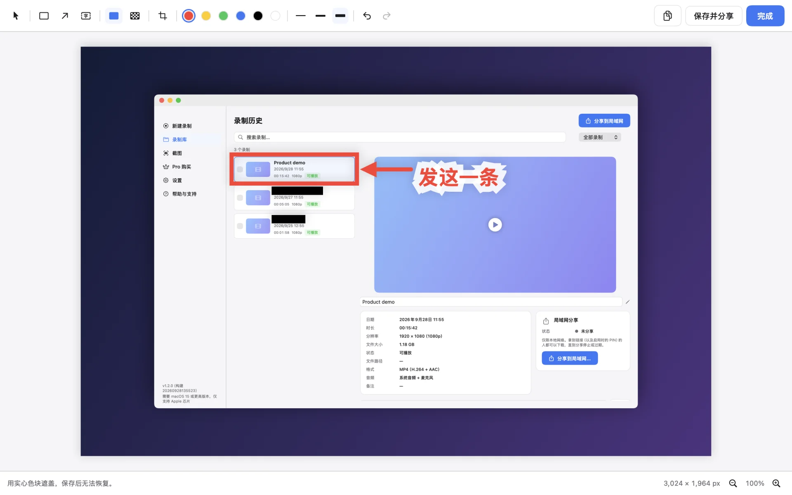
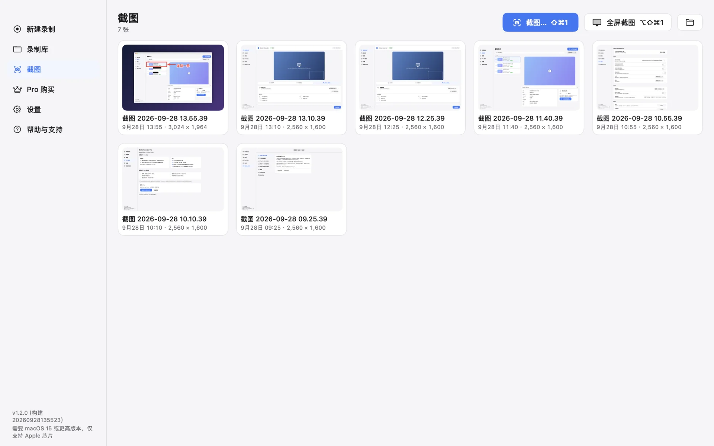
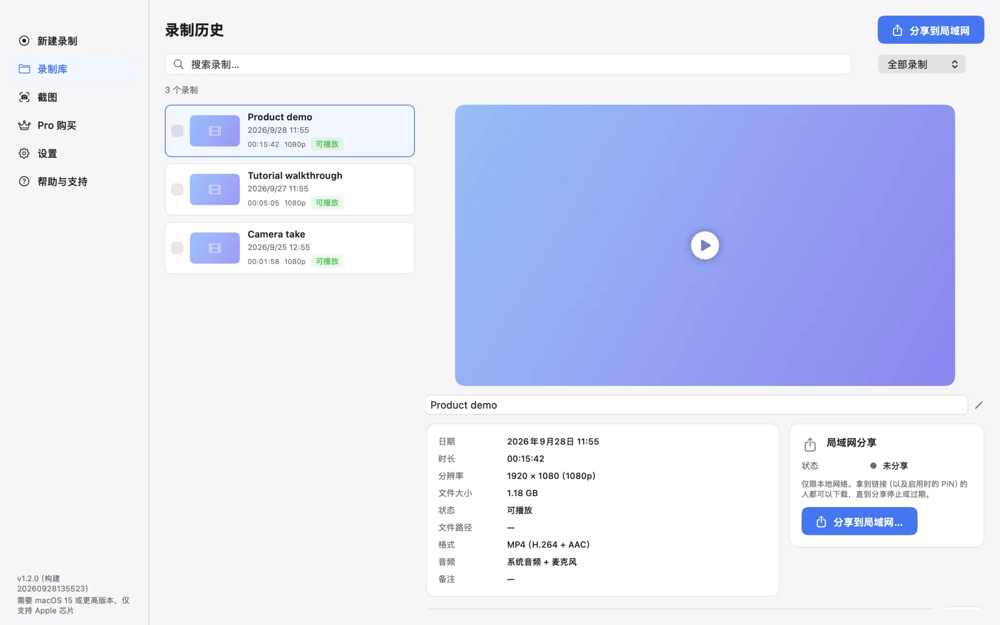
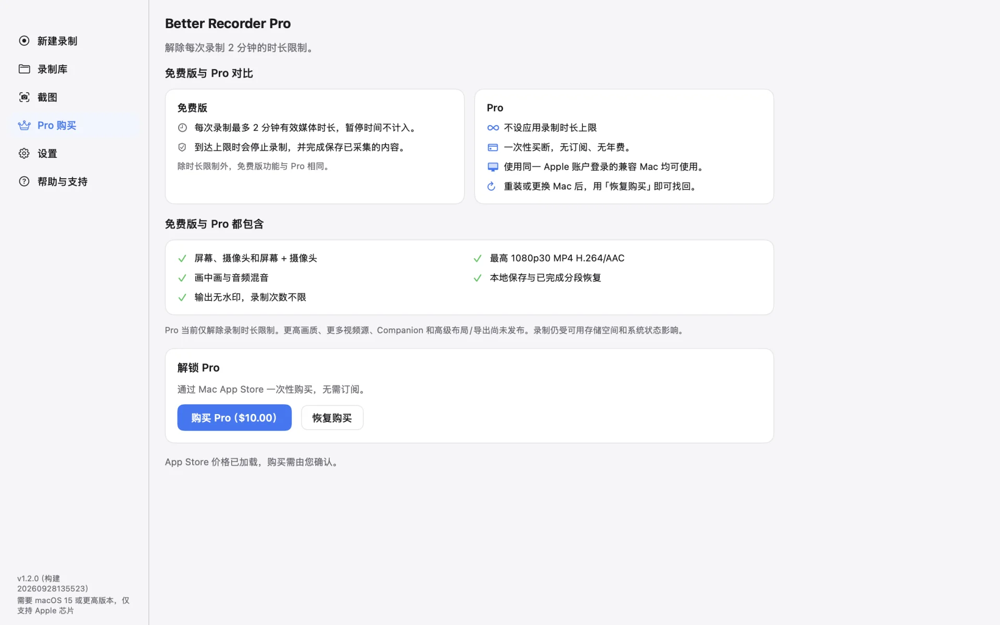
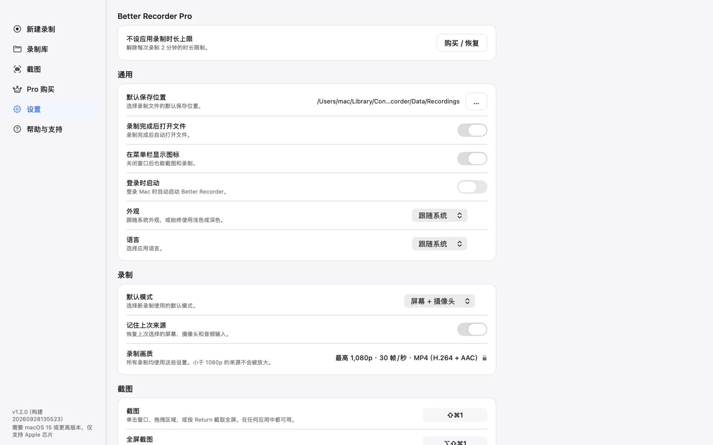

# Better Recorder Pro

[English](README.md) · 简体中文 · [日本語](README.ja.md) · [한국어](README.ko.md)

一款原生 macOS 应用：录屏、录摄像头或同时录制，还能截图并标注、遮挡敏感信息。

Better Recorder Pro 适合录制产品演示、教程与讲解视频。录制内容与截图保存在 Mac 本地，应用不会上传它们。

## 下载

Better Recorder Pro 仅在 Mac App Store 提供。免费下载，一次性购买 Pro 即可解除录制时长限制。

扫描二维码，在 Mac App Store 查看 Better Recorder Pro。

## 主要功能

- **三种录制模式** — 仅屏幕、仅摄像头，或屏幕 + 摄像头画中画。选择屏幕或窗口、摄像头与麦克风；屏幕模式下可按可用情况加入系统声音。
- **区域录制** — 只录制屏幕的一部分，并可选择显示鼠标指针、隐藏程序坞、菜单栏或本应用窗口、去除窗口阴影。
- **截图** — 按 ⇧⌘1 后单击窗口、拖拽区域，或按 Return 截取整个屏幕；按 ⌥⇧⌘1 直接截取指针所在的显示器。截图以 PNG 保存，并复制到剪贴板。
- **截图编辑器** — 遮挡、马赛克、裁剪、矩形框、箭头和文字。「遮挡」用实心色块覆盖，保存后原像素不再保留；「马赛克」仅为视觉打码。
- **录制库与局域网分享** — 查找、重命名和查看录制。为选中的录制或截图启动临时局域网分享，可设有效期和可选 PIN；同一局域网内的浏览器即可下载。
- **文件保存在本地** — 使用 1080p30 预设，保存为 H.264 视频与 AAC 音频的 MP4 文件。实际输出取决于所选来源与设备。
- **原生 macOS 体验** — 全局快捷键、菜单栏图标、浅色与深色外观，界面支持英文、简体中文、日文和韩文。

## 截图

**截图编辑器** — 六种工具随手标注，分享前先遮挡不该露出的内容

| | |
|---|---|
|  |  |
| **截图** — 所有截图集中在一处，一键框选或全屏截图 | **录制库** — 时长、分辨率、格式与音频一目了然，可直接在局域网分享 |
|  |  |
| **免费版与 Pro** — 功能相同，Pro 解除录制时长限制 | **设置** — 保存位置、菜单栏、外观、语言、默认模式与快捷键 |

截图由应用使用示例数据渲染生成，录制名称均为虚构。

## 免费版与 Pro

- 免费版可使用三种录制模式、截图和编辑器，每次最多录制 120 秒有效媒体内容，暂停时间不计入。
- 到达上限后，应用先停止并保存已录制的内容，再提示升级。
- Pro 是可选的一次性非消耗型 App 内购买，解除单次录制时长限制，不是订阅。重装后或在登录同一 Apple 账户的其他 Mac 上，使用「恢复购买」即可找回。
- Pro 目前仅解除录制时长限制。

## 隐私与已知限制

- 录制内容与截图保存在 Mac 本地，应用不会上传它们。
- 局域网分享只由你主动启动。它在本地网络上使用 HTTP，不上传任何内容，不使用云端存储；停止、过期、网络变化或退出应用后链接失效。同一网络中拿到链接（以及已启用的 PIN）的人都能下载分享的内容，建议开启 PIN。
- 录制需要相应的 macOS 权限（屏幕录制、摄像头、麦克风），并须征得被录制者同意。
- 录制中断时，应用会尝试恢复已完成的片段。恢复为尽力而为，未完成的片段或末尾部分可能丢失。
- 可使用内置摄像头、兼容的 USB 摄像头，或在满足 Apple 设备、账户与连接要求时，将兼容的 iPhone 用作连续互通相机。这使用的是 iPhone 摄像头，不录制 iPhone 屏幕。

## 支持

- [Mac App Store](https://apps.apple.com/app/id6809041086)
- [产品页](https://bettermac.net/products/better-recorder/)
- [报告问题](https://github.com/BetterMacNet/better-recorder/issues/new?template=bug_report.md)
- [功能建议](https://github.com/BetterMacNet/better-recorder/issues/new?template=feature_request.md)
- [安全问题报告](SECURITY.md)
- [支持中心](https://bettermac.net/support/?product=better-recorder)
- [联系我们](https://bettermac.net/contact/?product=better-recorder)
- [官网](https://bettermac.net/)
- [隐私政策](https://bettermac.net/privacy/)
- [使用条款](https://bettermac.net/en/terms/)

## 系统要求

- macOS 15.0（Sequoia）或更新版本
- 搭载 Apple 芯片的 Mac

## 许可

Better Recorder Pro 及本仓库中的原创材料为专有内容，并非开源。保留所有权利。未经 BetterMacNet 事先书面许可，不授予复制、修改、分发或使用这些内容的任何许可。
